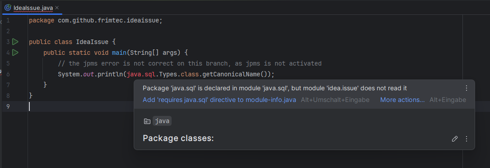

## Java Module Errors in IntelliJ IDEA 2025.1 
This IntelliJ IDEA Maven project tries to reproduce issue [IDEA-371051](https://youtrack.jetbrains.com/issue/IDEA-371051/Java-Module-Error-IDE).
The problem shows JPMS compile-issues in the code editor even though the project does not use JPMS at all.

Example: ```Package 'java.sql' is declared in module 'java.sql', which is not in the module graph```


The project compiles well with Maven as well as in IDEA itself, and the code runs without problems.

The quick-fix intention in the code editor adds a compile option to the affected module (`--add-modules java.sql`), which resolves the error message in the code editor.
But as soon as the Maven project is reloaded, these options are reverted again and the errors show up again.
Especially in large projects with 100+ IDEA modules, this is very cumbersome.

Unfortunately, the problem does not show up in all installations.
Comparing installations where the errors show up in the editors and the ones where they do not seem identical, at least from my point of view. 
Both installations use the same IDEA project, the same IDEA version (2025.1), the same project JDK (zulu-21.0.6), the same maven version (3.9.9).

This repo contains two branches:
* master: with jpms deactivated ==> the error should never be shown, but on some installations it does!
* with-jpms: with jpms activated ==> the error is always shown, which is correct.